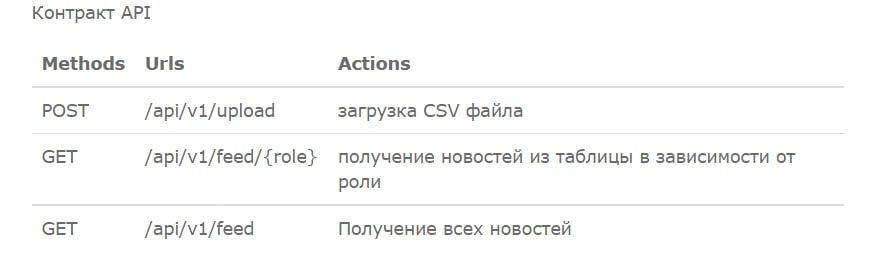

## MVP for the news-aggregator

### Сгенерить JAR файл
$ mvn install -DskipTests

### Создание image Spring Boot
$ docker build -t news-aggregator.jar .

### Запуск контейнеров Spring Boot и PostgreSQL
$ docker-compose up -d

Можно тестировать API endpointы.

